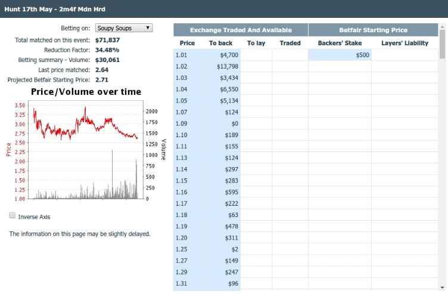
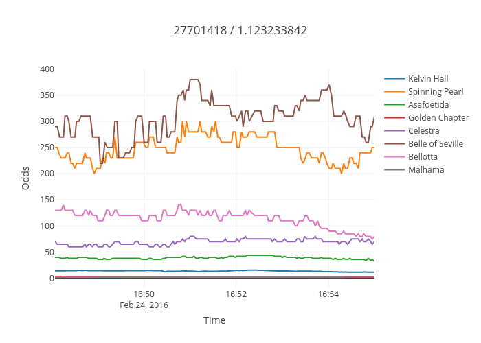
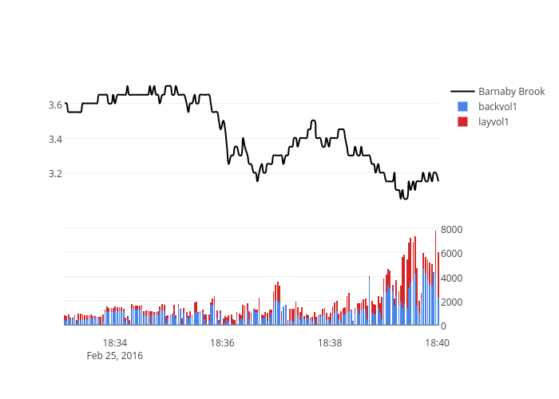

# betfair-price-fetcher
A couple of scripts for fetching prices at regular intervals up to a given event time. You can use it for algorithmic trading. Samples are geared towards getting preplay data but you can modify code to catch inplay events too.<br>
 __Disclaimer:__ I accepts no responsibility or liability for any losses which may be incurred by any person or persons using the whole or part of the contents of this software, i.e. don't blame me for lost money.<br>

## API Key and cers
1. Keys aren't free anymore, you need to pay for them :( Go [here](http://docs.developer.betfair.com/docs/display/1smk3cen4v3lu3yomq5qye0ni/Application+Keys).
2. Create certs and put them into certs dir. Go [here](http://docs.developer.betfair.com/docs/display/1smk3cen4v3lu3yomq5qye0ni/Non-Interactive+%28bot%29+login).

## Prerequisites
Only 2 reqs, you can get them directly here:
⋅⋅* https://github.com/jmcarp/betfair.py
⋅⋅* https://github.com/PyMySQL/PyMySQL

Or use pip:
```
$ pip install -r requirements.txt
```

You have to create 2 tables in your sql database. The commands are:
```
$ mysql -u username -p your_database < create_races_table.sql
$ mysql -u username -p your_database < create_price_table.sql
```

You can find these scripts in sql_scripts directory.<br>
If you don't own a server (UTC time), modify generate_events_schedule.py to get appropriate starting times.

## How to run these?
I recommend using at and cron for maximum convenience. The order is as follows:
1. get_betfair_races.py
2. generate_events_schedule.py
3. write_schedule.py
4. execute_schedule

## Sample output (after dumping some data from sql database to csv file)
```
$ csvcut price_dump.csv | head -n 10
27798433 / 1.124868018,3767988,Your Gifted,2016-05-17,18:38:04,13.50,21.62,399.66,13.50,0.66,14.00,61.74,203.29
27798433 / 1.124868018,3767988,Your Gifted,2016-05-17,18:38:07,13.50,21.62,399.66,13.50,0.66,14.00,61.74,203.29
27798433 / 1.124868018,3767988,Your Gifted,2016-05-17,18:38:10,13.50,21.62,460.87,13.50,0.69,14.00,61.74,203.29
27798433 / 1.124868018,3767988,Your Gifted,2016-05-17,18:38:13,13.50,21.62,460.87,13.50,0.69,14.00,61.74,203.29
27798433 / 1.124868018,3767988,Your Gifted,2016-05-17,18:38:15,13.50,21.62,460.87,13.50,0.69,14.00,61.74,203.29
27798433 / 1.124868018,3767988,Your Gifted,2016-05-17,18:38:18,13.50,21.62,460.87,13.50,0.69,14.00,61.74,203.29
27798433 / 1.124868018,3767988,Your Gifted,2016-05-17,18:38:25,13.50,21.62,460.87,13.50,0.68,14.00,74.63,216.18
27798433 / 1.124868018,3767988,Your Gifted,2016-05-17,18:38:28,13.50,21.62,460.87,13.50,0.68,14.00,74.63,216.18
27798433 / 1.124868018,3767988,Your Gifted,2016-05-17,18:38:31,13.50,21.62,460.87,13.50,0.68,14.00,74.63,216.18
27798433 / 1.124868018,3767988,Your Gifted,2016-05-17,18:38:34,13.50,21.62,469.93,13.50,0.67,14.00,86.04,236.44

$ csvcut races_dump.csv | head -n 10
2016-05-03,GB,Brighton,13:20:00,27781036 / 1.124612414,5f Nov Stks
2016-05-03,GB,Brighton,13:50:00,27781036 / 1.124612419,6f Hcap
2016-05-03,GB,Brighton,14:20:00,27781036 / 1.124612424,1m Hcap
2016-05-03,GB,Brighton,14:55:00,27781036 / 1.124612429,1m4f Hcap
2016-05-03,GB,Brighton,15:25:00,27781036 / 1.124612434,1m2f Stks
2016-05-03,GB,Brighton,15:55:00,27781036 / 1.124612439,7f Hcap
2016-05-03,GB,Brighton,16:25:00,27781036 / 1.124612444,5f Hcap
2016-05-03,GB,Catterick,16:55:00,27781037 / 1.124612459,5f Nov Stks
2016-05-03,GB,Catterick,17:25:00,27781037 / 1.124612464,1m4f Claim Stks
2016-05-03,GB,Catterick,17:55:00,27781037 / 1.124612469,7f Mdn Stks
```
## What can you do with data?
Betfair charts ain't fun, right?


For instance, we can plot prices using our data and get some insights about markets.

Whole market


Specified runner


I used python and plot.ly to get nice and interactive chart:
